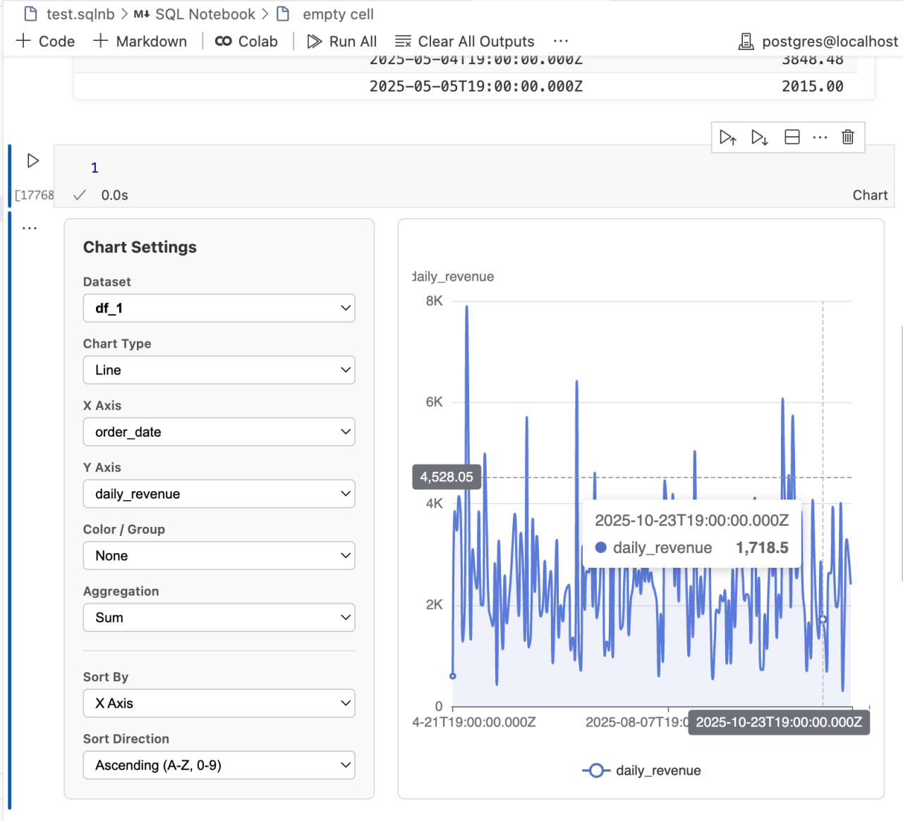
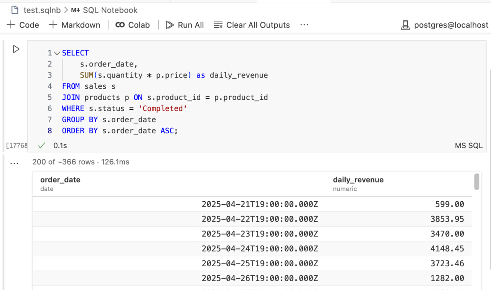

# SQL Notebook

**Jupyter-style SQL notebooks inside VS Code.** Connect to PostgreSQL or DuckDB, write queries, and visualize results — all without leaving your editor.


<br>


---

## Getting Started

```
Install → Connect → Create → Query → Visualize
```

**1. Install**
Search for **"SQL Notebook EDA"** in VS Code Extensions, or install the `.vsix` from the [releases](https://github.com/YaDilmurod/sqlnb/releases).

**2. Connect to a Database**
`Cmd+Shift+P` → `SQL Notebook: Connect to Database` → paste your connection string.

> Supports **PostgreSQL** (`postgres://...`) and **DuckDB** (local `.duckdb` files).

**3. Create a Notebook**
`Cmd+Shift+P` → `SQL Notebook: New Notebook` — or simply create a `.sqlnb` file.

> New notebooks auto-include a **Schema Browser** at the top so you can explore tables, views, and materialized views right away.

**4. Write & Run SQL**
Write SQL in any code cell and hit **▶ Run**. Results appear as a sortable, paginated table.

**5. Add Visualizations**
Click **📊 Add Chart Cell** in the toolbar → pick X/Y axes → click **▶ Run Chart**.

---

## Features

| Feature | What it does |
|---|---|
| **Notebook Format** | Mix Markdown + SQL + Charts in `.sqlnb` files |
| **Schema Browser** | Browse tables, views, and materialized views with toggle filters (📄 / 👁 / 🧊) |
| **Smart Tables** | Server-side cursors for large datasets — zero RAM spikes |
| **Server-Side Sort** | Click column headers to sort millions of rows on the DB side |
| **Charts** | Bar, Line, Scatter, Pie via ECharts — with multiple Y axes, separate axes, and log scale |
| **Data Profile** | One-click summary statistics (numeric, categorical, date columns) |
| **Query Cancel** | Stop runaway queries instantly via interrupt |
| **CSV Export** | Export any result to CSV |
| **Connection Manager** | Save multiple connections, switch with one click |

---

## Keyboard Shortcuts

| Action | Shortcut |
|---|---|
| Open Command Palette | `Cmd+Shift+P` |
| Run Cell | `Shift+Enter` |
| Add Cell Below | `Cmd+Shift+Enter` |

---

## Requirements

- **VS Code** ≥ 1.80
- **PostgreSQL** or **DuckDB** database

---

## Links

- [GitHub Repository](https://github.com/YaDilmurod/sqlnb)
- [Changelog](CHANGELOG.md)
- [VS Code Marketplace](https://marketplace.visualstudio.com/items?itemName=SQLNB.sqlnb-visualizer)

---

**Developed by [Dilmurod Yarmukhamedov](https://www.linkedin.com/in/dilmurod-yarmukhamedov-946302205/)**
